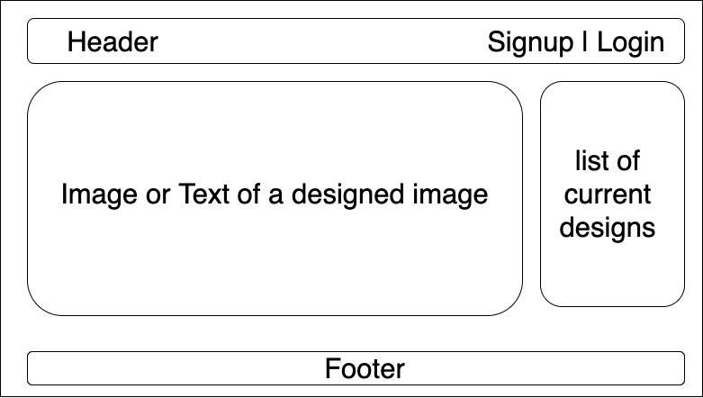

## Project 2 - Sachin Ramteke

## Project Overview

#Project Description

"Design Room" App helps users/designers to browse the available rooms to design, and use their creative skills to decorate the rooms using the available list of design items such as sofa, chair, sidetable, coffee table, wall paintings.

Developer: Sachin Ramteke
Learning goal: Develop a full-stack application with the following features

- Password protected
- Incorporate authentication capabilities
- Data persistence with PostgreSQL & Sequelize
- Heroku production deployment
- Implementation of REST-ful routes

## Minimum Viable Product (MVP):-

- Designer App goal: The application has been developed to provide a basic functionality:
  - Users/Designers can see available rooms to design
  - Users can see the design items (ex. sofa, side table, chair etc..) to design their preferred room

* A working full-stack application, using Node.js, Express and EJS, Postgres, Sequelize
* Adherence to the MVC file structure: Models, Views, Controllers
* RESTful routes and full CRUD - Create, Read, Update, Delete functioanlities

- Render data on webpage
- Allow user to interact with the page
- Signup, Login, Logout

## Project Links

github repo :- https://github.com/sramteke171/deere-project2-starter

deployment :- https://room-designer-app.herokuapp.com/

## Wireframes

Upload images of wireframe to cloudinary and add the link here with a description of the specific wireframe.

ER Diagram: see ER_Digram.jpeg file (included under images folders)

App homepage Wireframe: (included under images folders)

## Technologies

- HTML
- CSS
- JavaScript
- Node.JS
- JSON ("jsonwebtoken": "^8.5.1")
- Express
- EJS
- Postgres DB ("pg": "^3.0.0")
- Sequelize ("sequelize": "^6.3.3"; "sequelize-cli": "^6.2.0")
- Browser compliant: Chrome, IE, Firefox

## Additional Libraries

- Dependencies on following packages:
  - "bcryptjs": "^2.4.3",
  - "cookie-parser": "^1.4.5",
  - "dotenv": "^8.2.0",
  - "ejs": "^3.1.3",
  - "express": "^4.17.1",
  - "jsonwebtoken": "^8.5.1",
  - "method-override": "^3.0.0",
  - "pg": "^8.3.0",
  - "sequelize": "^6.3.3",
  - "sequelize-cli": "^6.2.0"

## Framework used

- MVC Framework

Controllers:

- authController.js - for aunthentication routes
- userController.js - routes for user actions
- roomController.js - routes for room design
- itemController.js - for design items

Models:

- city.js
- user.js
- room.js
- item.js
- index.js

Views:

- index.ejs
- signup.ejs
- login.js
- profile.ejs
- room.ejs
- newRoom.ejs
- edit.ejs
- design.ejs
- item.ejs

## Components

- App:- This will make the initial data pull and include functionality, React Router
- Header:- This will render the header include the nav
- Footer:- This will render the header include the nav

## MVP User Stories:

1.  UserStory 01: App Landing page

    - As a user, I would like to see the homepage of room-designer app with the functions to signup a new user and Login the existing user

2.  UserStory 02: New User Creation

    - As a user, I would like to see the signup form after clicking Signup on homepage
    - new user infomration should be inserted into postgres DB after clicking Sign Up button
    - take me to User profile, after Signup

3.  UserStory 03: Encrypt the Password

    - As a user, I would like my password to be encrypted while storing into postgres db, after clicking Sign Up button on homepage

4.  UserStory 04: Login user

    - As a user, I would like to be able to login into the room-designer-appp using my username and password.
    - take me to User profile, after Signup

5.  UserStory 05: Validate user at Login

    - As a user, I would like to get some sort of message to indicate either the username or password was incorrect. Ex. "Bad request"

6.  UserStory 06: EDIT UserProfile

    - As a user, I would like the ability to edit the my profile after (a) creation of a new user (b) after successful login.
    - After clicking a "EDIT" button, edited information should be inserted into postgres DB

7.  UserStory 07: DELETE UserProfile

    - As a user, I would like the ability to DELETE a particular room.
    - After clicking a "DELETE" button of a specific room, chosen room should be deleted from postgres DB
    - take me to updated list of rooms after deleting a room

8.  UserStory 08: View all Rooms for design

    - As a user, after successful login, I would like to see the list of all available rooms to design.
    - Show the links to (a) go back to homepage (b) Link for creating a new room

9.  UserStory 09: New Room Creation

    - As a user, I would like the ability to create a new room, after clicking a "create new room".
    - I would like to see the page/form to create a new room
    - after filling the room info and clicking create button, a new room should be inserted into postgres DB
    - after a new room is created, it should display in the list of available rooms to design

10. UserStory 10: EDIT Room

    - As a user, I would like the ability to edit the room, and change image or name of room.
    - After clicking a "EDIT" button, edited information should be inserted into postgres DB
    - edited should display in the list of available rooms to design

11. UserStory 11: DELETE Room

    - As a user, I would like the ability to DELETE the particular room.
    - After clicking a "DELETE" button of a specific room, chosen room should be deleted from postgres DB
    - take me to list of rooms after deleting a room

12. UserStory 12: Enlarge the Room after clicking on room image or name of room

    - As a user, after clicking either on the room image OR name of room, I would like to see the enlarged room to design

13. UserStory 13: View all Design Items to decorate room

    - As a user, after clicking in the enlarged room to design, I would like to see the list of all available design items. for example, sofa, side table, coffe table, carpet, wall painting etc.

## Stretch Goal / Above & Beyond: (Drag and drop is partially working)

- Users can "click"/"Drag and drop" design items to decorate the rooms.
  PostMVP, there would be addional Models:
  For example, roomItems with many to many association

## Time Frames

Component Priority Estimated Time Time Invetsted Actual Time

- Adding Form H 4hrs 3.5hrs 3.5hrs
- CSS H 4hrs 6 hrs 6hrs
- Working with database,tables H 8hrs 6.5hrs 6.5hrs
- Coding H 8hrs 5.5hrs 5.5hrs
- Testing H 4hrs 4hrs 4hrs
- Documentation M 2hrs 2hrs 2hrs
- Total H 30hrs 27.5hrs 27.5hrs

## Issues and Resolutions

ERROR:
Refused to apply style from 'https://room-designer-app.herokuapp.com/css/itemIndex.css' because its MIME type ('text/html') is not a supported stylesheet MIME type, and strict MIME checking is enabled.

RESOLUTION: Heroku didnt recognized Capital letter in the file name. Rename the file with all lower case

## Next Steps: "PostMVP - Stretch Goal"

- Rewrite Drag & Drop logic for designing room

#Nice to have - Recommended Features:

- Use a CSS framework like Bootstrap
- Add additional relationships
- Use EJS Partials
- Incorporate Google Maps
- Google Chart
