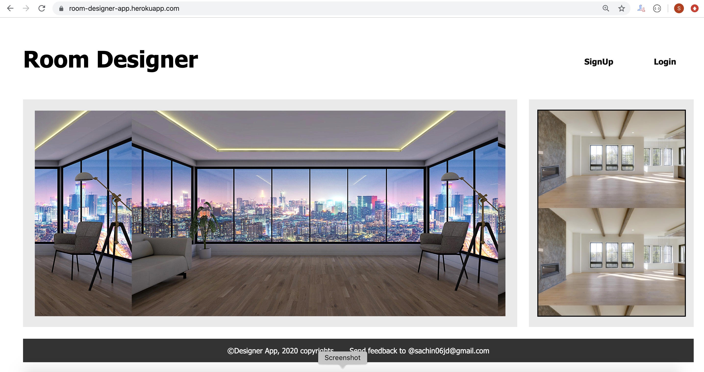
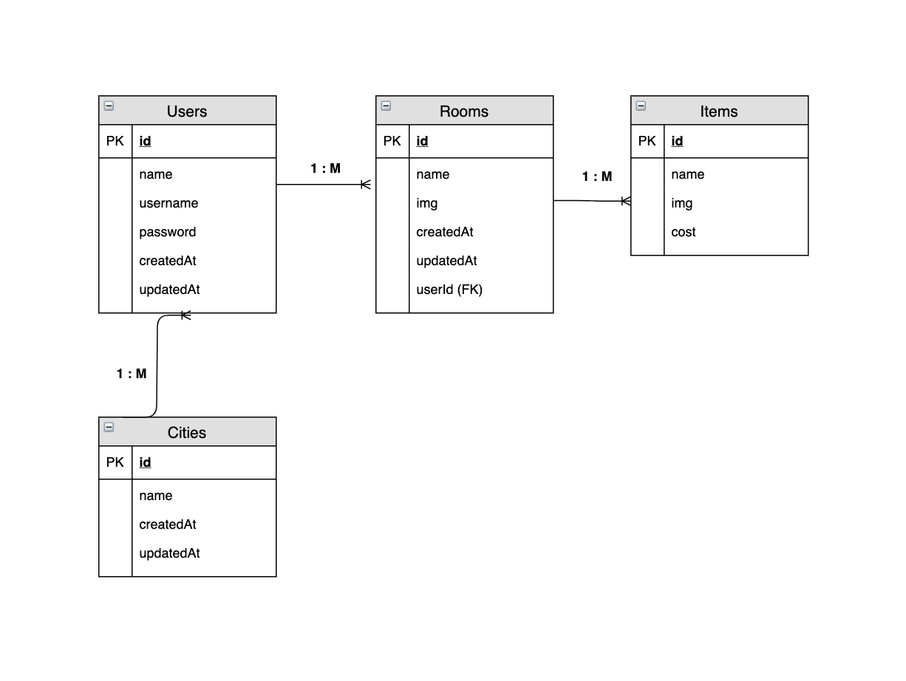

## Project 2 - Sachin Ramteke

## Project Overview

#Project Description

"Design Room" App helps users/designers to browse the available rooms to design, and use their creative skills to dcorate the rooms using the available list of design items such as sofa, chair, sidetable, coffee table, wall paintings.

## Minimum Viable Product (MVP):-

- Users/Designers can see available rooms to design
- Users can see the design items (ex. sofa, side table, chair etc..) to design their preferred room

* A working full-stack application, using Node.js, Postgres, Express and EJS
* Adherence to the MVC file structure: Models, Views, Controllers
* At least one model with all 7 RESTful routes and full CRUD.
* At least 2 models that are associated in some way (e.g. one-to-many, many-to-many, etc)
* ❗ A git repository not inside the class repo.

* implement at least 10 User Stories
* Include wireframes that you designed during the planning process
* Be deployed online and accessible to the public via Heroku
* Have a link to your hosted working app in the README.md file in your github repo

* A README.md file with explanations of the technologies used, the approach was taken, unsolved problems, user stories, and notes to yourself so you can come back to your project later in the course and be able to pick up your train of thought, etc.

## MVP - Stretch Goal:

- more than 2 models
- Authentication - encrypt-decrypt passwords

#Nice to have - Recommended Features

- Add additional relationships
- Include sign up/log in functionality, with encrypted passwords & an authorization flow
- Use EJS Partials

## Project Links

github repo :- https://github.com/sramteke171/deere-project2-starter

deployment

## Wireframes

Upload images of wireframe to cloudinary and add the link here with a description of the specific wireframe.

ER Diagram: see ER_Digram.jpeg file (included under images folders)

wireframes
react architecture
Define the the React components and the architectural design of your app.

## Technologies

- HTML
- CSS
- JavaScript
- Node.JS
- Express
- EJS
- Postgres DB
- Browser compliant: Chrome, IE, Firefox

## Framework

- MVC Framework

## MVP

- Render data on webpage
- Allow user to interact with the page
- Signup, Login, Logout. CRUD - Create, Read, Update, Delete functioanlities

#MVP User Stories:

- US01:

2. As a user I would like to enter my name before playing
3. As a user I want to see a Play and Next buttons.
4. As a user when I click on Play button, I want to see the first Trivia question
5. As a user when I click on the options presented in the answer, I want to see an alert message to indicate that I selected the right or wrong answer
6. As a user, when I select the answer, I want to see my score updated
7. As a user, when I click on NEXT button, I want to see the next trivia question
8. When all questions are answered, I want to see the results of the game with appropriate user messages.

- US02:
- US03:
- US04:
- US05:
- US06:
- US07:
- US08:
- US09:
- US10:

Controllers:

- authController.js - for aunthentication routes
- userController.js - routes for user actions
- roomController.js - routes for room design
- itemController.js - for design items

Models:

- city.js
- user.js
- room.js
- item.js
- index.js

## PostMVP - Stretch Goal:

- Use a CSS framework like Bootstrap
- Incorporate Google Maps

## Above & Beyond:

- Users can "click"/"Drag and drop" design items to decorate the rooms.
  PostMVP, there would be addional Models:
  For example, roomItems with many to many association

- roomItems.js

## Components

#Component Description

- App:- This will make the initial data pull and include React Router
- Header This will render the header include the nav
- Footer This will render the header include the nav

## Time Frames

Component Priority Estimated Time Time Invetsted Actual Time

- Adding Form H 4hrs 3.5hrs 3.5hrs
- CSS H 4hrs 6 hrs 6hrs
- Working with database,tables H 8hrs 6.5hrs 6.5hrs
- Coding H 8hrs 5.5hrs 5.5hrs
- Testing H 4hrs 4hrs 4hrs
- Documentation M 2hrs 2hrs 2hrs
- Total H 30hrs 27.5hrs 27.5hrs

## Additional Libraries

- Dependencies on following packages:
  - "bcryptjs": "^2.4.3",
  - "cookie-parser": "^1.4.5",
  - "dotenv": "^8.2.0",
  - "ejs": "^3.1.3",
  - "express": "^4.17.1",
  - "jsonwebtoken": "^8.5.1",
  - "method-override": "^3.0.0",
  - "pg": "^8.3.0",
  - "sequelize": "^6.3.3",
  - "sequelize-cli": "^6.2.0"

## Code Snippet

## Issues and Resolutions

Example,
ERROR: app.js:34 Uncaught SyntaxError: Unexpected identifier
RESOLUTION: Missing comma after first object in sources {} object
